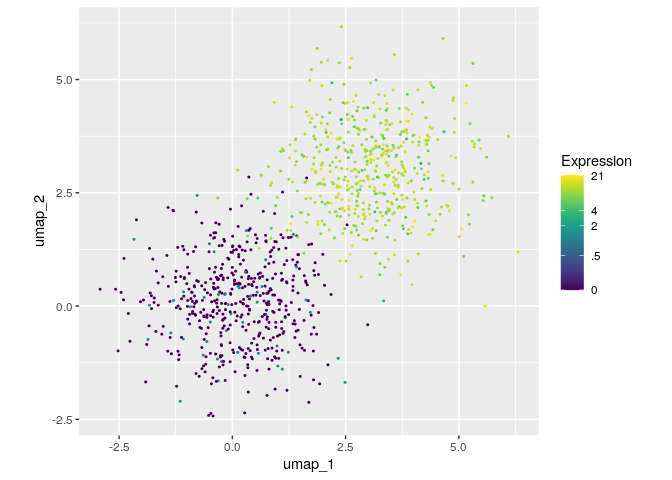

<!-- README.md is generated from README.Rmd. Please edit that file -->

# scUtils

<!-- badges: start -->

<!-- badges: end -->

The goal of scUtils is to collect utility functions that make
single-cell RNAseq data analysis simple and understandable for anyone.
At the same time, I will use it when writing my PhD thesis.

## Installation

You can install the released version of scUtils from
[CRAN](https://CRAN.R-project.org) with:

``` r
install.packages("scUtils")
```

And the development version from [GitHub](https://github.com/) with:

``` r
# install.packages("devtools")
devtools::install_github("FelixTheStudent/scUtils")
```

## Example: Single-Cell Feature Plot

Feature Plots highlight gene expression in a 2-dimensional embedding
(computed e.g. with UMAP or tSNE).

``` r
library(scUtils)

# simulate some data
set.seed(100)
my_umap <- matrix(rnorm(2000, c(.1, 3)), ncol=2, dimnames = list(NULL, c("umap_1", "umap_2")))
my_expr <- rpois(1000, c(.1, 11))

feat(my_umap, my_expr)
```


